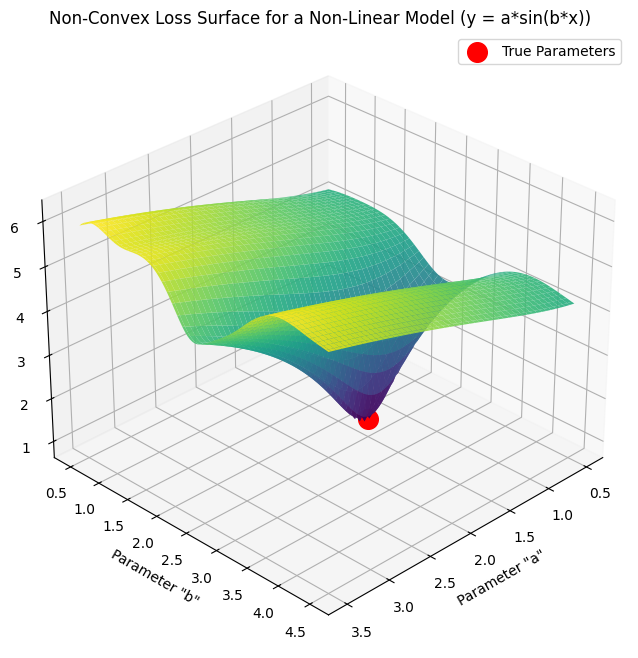

# Linear Regression - Normal Equation

Analytical closed-form solution for linear regression that directly computes optimal parameters without iterative optimization.

## Overview

The Normal Equation is a **solution method** for linear regression that uses the [least squares](../../least_squares/) objective.

**Relationship:**
- **Least Squares** = The optimization objective (minimize Σ(y - ŷ)²) - see [../../least_squares/](../../least_squares/)
- **Normal Equation** = An analytical solution method (works only for models linear in parameters)
- **Linear Regression** = The model (ŷ = Xθ, linear in parameters)

For a deeper understanding of the least squares method and why we minimize squared residuals, see the [Least Squares documentation](../../least_squares/README.md).

## Theory

The Normal Equation solves for parameters θ that minimize the Mean Squared Error by setting the gradient to zero and solving analytically.

### The Formula

The Normal Equation for the parameter vector `θ` is:
```
θ = (X^T X)^(-1) X^T y  (Eq. 1)
```

Where:
- `θ`: Parameter vector [θ₀, θ₁, ..., θₙ]^T containing bias and weights
- `X`: Design matrix (m × n+1) including bias column
- `X^T`: Transpose of X
- `y`: Target values (m × 1)
- `(X^T X)^(-1)`: Inverse of (X^T X)

### Design Matrix Structure

The design matrix, often denoted as `X`, is a fundamental component in linear regression. It organizes the input features for all training examples.

-   **Rows (m)**: Each row in the design matrix `X` represents a single **training example** or **data point**. The total number of rows, `m`, signifies the number of samples in your dataset.
-   **Columns (n+1)**: Each column in `X` represents a **feature** (or independent variable). The total number of columns is typically `n+1`, where `n` is the number of actual features, and the additional column is a vector of ones (`x₀ = 1`) that accounts for the intercept term (bias `θ₀`) in the linear model.

For simple linear regression (e.g., `y = wx + b`), where `x` is a single feature, the design matrix `X` with an added bias column looks like this:

```
X = [[1  x₁]
     [1  x₂]
     [1  x₃]
     [...  ...]]
```

The first column of 1s (often denoted as `x₀`) is a crucial addition. It ensures that the intercept term (`θ₀`) is included in the model's prediction for every data point. When the model calculates `Xθ`, this column of ones gets multiplied by `θ₀`, effectively adding `θ₀` to each prediction: `y_pred = θ₀ * 1 + θ₁ * x₁ + ...`. This allows the regression line or plane to shift vertically, providing a better fit to data that doesn't necessarily pass through the origin. For multiple linear regression, you would have additional columns for each feature (`x₂`, `x₃`, etc.), but the initial column of ones for the intercept remains.

## Mathematical Derivation

Starting from the [least squares](../../least_squares/README.md) cost function:

The linear model (our hypothesis) in matrix form is given by:
```
y = Xθ  (Eq. 2)
```
Where `y` represents the predicted target values, `X` is the design matrix, and `θ` is the parameter vector.

The Mean Squared Error (MSE) cost function aims to minimize the sum of the squared differences between the predicted values (`h(x^(i))`) and the actual target values (`y^(i)`). In summation form, it is written as:
`J(θ) = (1/2) * Σ(h(x^(i)) - y^(i))²`

To convert this summation into matrix notation, we first define the **error vector `ε`**:
For each training example `i`, the error is `ε_i = h(x^(i)) - y^(i)`.
The entire vector of errors `ε` for all `m` training examples is:
```
ε = Xθ - y
```
This `ε` is an `(m, 1)` column vector.

The sum of the squares of the elements in `ε` (i.e., `Σ ε_i²`) can be expressed as the matrix multiplication of `ε`'s transpose (`εᵀ`) by `ε` itself:
```
εᵀε = [ε_1  ε_2  ...  ε_m] * [[ε_1]
                                 [ε_2]
                                 [ ... ]
                                 [ε_m]]
    = ε_1² + ε_2² + ... + ε_m²
    = Σ ε_i²
```
Substituting `ε = Xθ - y` back into `εᵀε` gives us `(Xθ - y)ᵀ(Xθ - y)`.

Therefore, the cost function can be written in matrix form as:

1. **Cost function (Sum of Squared Errors)**:
```
J(θ) = (1/2m)(Xθ - y)^T(Xθ - y)  (Eq. 3)
```
2. **Take the gradient with respect to θ**:
```
∇_θ J(θ) = (1/m)(X^T Xθ - X^T y)  (Eq. 4)
```
3. **Set the gradient to zero**:
```
X^T Xθ - X^T y = 0  (Eq. 5)
```
4. **Solve for θ (Rearrange to get the Normal Equation)**:
```
θ = (X^T X)^(-1) X^T y  (Eq. 6)
```

This derivation is only possible because the model is **linear in parameters**. For non-linear models, we must use iterative methods.

## Implementation Approaches: Single vs. Multiple Features

In this directory, we provide two distinct implementations to demonstrate how linear regression can be solved analytically. This highlights the difference between solving for a single feature versus multiple features.

-   `simple_linear_regression_partial_derivatives.py`: This script solves **simple linear regression** (one input feature) by using the explicit algebraic formulas for the slope (`β₁`) and intercept (`β₀`) that are derived from setting the partial derivatives of the cost function to zero. This approach is intuitive and works well for a single feature but becomes very complex to derive and implement for multiple features.

-   `multiple_linear_regression_normal_equation.py`: This script solves **multiple linear regression** (one or more input features) using the **Normal Equation** in its matrix form: `θ = (XᵀX)⁻¹Xᵀy`. This is the standard and more powerful approach.

### Why Use the Matrix-Based Normal Equation?

While the partial derivative formulas are excellent for understanding the mechanics of minimizing error for a single feature, the matrix-based Normal Equation is the preferred method in practice for several key reasons:

1.  **Generality and Scalability**: The matrix formula is universal. It works exactly the same whether you have one feature or thousands of features. The only thing that changes is the shape of your design matrix `X`. This makes the code far more scalable and flexible without needing to derive new formulas for each new feature.

2.  **Conciseness and Readability**: The matrix form is mathematically elegant and provides a compact way to represent the entire system of equations. For those familiar with linear algebra, `θ = (XᵀX)⁻¹Xᵀy` is much cleaner than a series of complex summation formulas.

3.  **Computational Efficiency**: Modern numerical computing libraries like **NumPy** are highly optimized to perform matrix operations (multiplication, inversion, etc.) extremely fast. These libraries use low-level, compiled code (often C or Fortran) that is significantly more performant than writing the equivalent logic with explicit loops in Python. This makes the matrix approach much faster for any non-trivial amount of data.

In summary, the partial derivative method provides valuable insight into the optimization process for a simple case, while the Normal Equation provides a general, efficient, and scalable solution for real-world machine learning applications.

## Exploration: Parameter Dimensions in Deep Learning

Our discussion of `θ` (theta) in linear regression as a vector `(n+1, 1)` applies to models with a single output. However, in deep learning, particularly within neural networks, the parameters (weights) often take on higher dimensions, typically matrices. This is a crucial concept for understanding how neural networks learn complex representations.

Consider a hidden layer in a neural network:

-   **Inputs (`X`):** This layer receives inputs, which could be the original features or the activations from a previous layer. Let's say these inputs have `N_in` dimensions (i.e., `X` is of shape `(m, N_in)` where `m` is batch size).
-   **Outputs / Neurons (`Z`):** The hidden layer itself consists of `N_out` neurons. Each neuron produces an independent output (activation). This means the layer outputs `N_out` values for each input example (`Z` is of shape `(m, N_out)`).

To transform the `N_in` inputs into `N_out` outputs, the "theta" equivalent is no longer a vector but a **weight matrix `W`** of shape `(N_in, N_out)`. This `W` matrix facilitates the linear transformation `XW`, where each column of `W` corresponds to the weights connecting all `N_in` inputs to a specific one of the `N_out` neurons.

Additionally, each of the `N_out` neurons typically has its own bias term. This is represented by a **bias vector `b`** of shape `(1, N_out)`.

So, the operation for a hidden layer is often expressed as: `Z = activation(XW + b)`.

Here, the "additional dimension" in the parameter `W` refers to `N_out`, the number of neurons in that hidden layer. This expansion from a parameter vector in linear regression to a parameter matrix in neural networks allows each neuron to learn a different combination of the input features, significantly increasing the model's capacity to extract and learn more abstract and complex patterns from the data.

## Advantages

- **No hyperparameters**: No learning rate or iteration count to tune
- **Exact solution**: Computes mathematically optimal parameters
- **Single computation**: No iterative training loop needed
- **Deterministic**: Always produces the same result

## Disadvantages

- **Computational complexity**: O(n³) due to matrix inversion
- **Memory intensive**: Must compute and store X^T X
- **Large features**: Becomes slow when n > 10,000
- **Matrix inversion**: Fails if X^T X is singular (use pinv instead)

## Comparison with Gradient Descent

| Aspect | Normal Equation | Gradient Descent |
|--------|----------------|------------------|
| Iterations | None | Many (500+) |
| Learning rate | Not needed | Must tune (0.01) |
| Complexity | O(n³) | O(kn²m) |
| Large n | Slow | Fast |
| Exact solution | Yes | Approximate |
| Implementation | Simple | More complex |

Where k = iterations, n = features, m = examples

## When Can You Use the Normal Equation?

The Normal Equation **only works** when your model is **linear in parameters**:

✅ **Can use Normal Equation:**
- Linear regression: y = θ₀ + θ₁x
- Polynomial regression: y = θ₀ + θ₁x + θ₂x² (linear in θ, non-linear in x)
- Multiple regression: y = θ₀ + θ₁x₁ + θ₂x₂

❌ **Cannot use Normal Equation:**
- Exponential: y = θ₀ * e^(θ₁*x) (non-linear in θ₁)
- Logistic: y = θ₀ / (1 + θ₁*e^(-θ₂*x)) (non-linear in parameters)

### Why the Limitation?

The analytical solution provided by the Normal Equation, derived by setting the gradient of the Mean Squared Error (MSE) to zero, implicitly assumes that the loss function is **convex**. A convex loss function guarantees a single, unique global minimum.

When a model is non-linear in its parameters, the resulting MSE loss function is typically **non-convex**. This creates a complex landscape with multiple "valleys" (local minima), as shown below for the model `y = a * sin(b*x)`.



Non-convex functions can have:
- Multiple local minima
- Local maxima
- Saddle points

At all these points, the gradient with respect to the parameters is zero. Consequently, simply solving for where the gradient is zero (as the Normal Equation does) would not reliably identify the global minimum. It might find a local minimum, a maximum, or a saddle point, and it cannot distinguish between them. For such non-convex problems, iterative optimization methods like Gradient Descent are necessary, though they also face challenges like getting stuck in local minima.

For non-linear models, you must use iterative optimization (gradient descent, Gauss-Newton, etc.).

See [Least Squares - Applicability](../../least_squares/README.md#applicability-linear-vs-non-linear-functions) for details.

## Reference

- Deep Learning Book, Section 5.1.4: Example: Linear Regression
- The formula derives from solving ∇_w MSE(w) = 0 for the [least squares objective](../../least_squares/)
