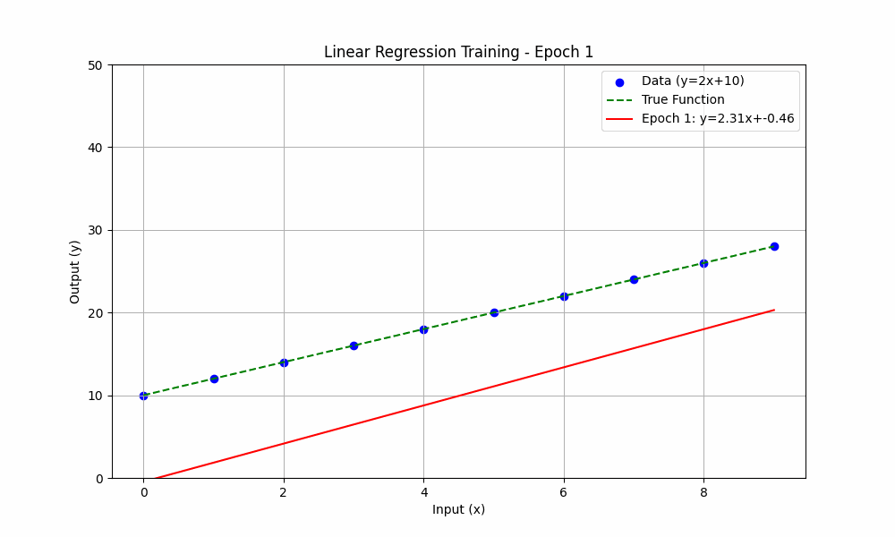

# Iterative Linear Regression

This directory contains an implementation of linear regression using an iterative method (Gradient Descent).

## `gradient_descent_linear_regression.py`

This script uses PyTorch to estimate a linear function by iteratively optimizing the model parameters using stochastic gradient descent (SGD).

### Model

-   **Model:** `y = wx + b`
-   **Optimizer:** `torch.optim.SGD`
-   **Loss Function:** Mean Squared Error (`nn.MSELoss`)

### Usage

The script can be run directly to train the model and visualize the results:
```
python gradient_descent_linear_regression.py
```

## Learning Visualization

The animation below shows how the linear regression model iteratively adjusts its parameters (weight and bias) over epochs to fit the training data, and how the loss decreases over time.


